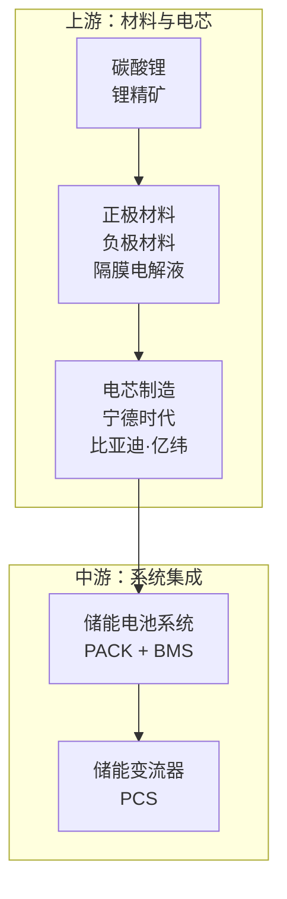

# Flowchart to Instagram Card

将 Mermaid flowchart TD 或层级内容转换为 Instagram 风格信息图，适合微信公众号投放。

## 特性

- **Mermaid 解析器**：自动解析 `.mmd` 文件生成信息图
- Instagram 经典渐变背景（紫→红→橙）
- 2×2 品牌水印布局（透明度 6%，旋转 -20°）
- 半透明毛玻璃卡片，柔和配色
- 智能布局：支持层级递进、树形结构
- Icon 支持：Font Awesome + Emoji + 自动匹配

## 快速开始

```bash
cd ~/projects/flowchart-to-instagram

# 步骤1：解析 Mermaid 文件生成 HTML
python scripts/parse_mermaid.py data/input.mmd output/output.html

# 步骤2：HTML 转 PNG 截图
node scripts/screenshot.mjs output/output.html output/output.png
```

## 使用方法

### 方法一：Mermaid 解析器（推荐）

自动解析 Mermaid flowchart TD 语法，生成 Instagram 风格信息图。

**支持的 Mermaid 格式**：


**解析器特性**：
- 自动提取 subgraph 作为层级卡片
- 节点格式：`A["标题\n描述"]`（换行符分隔）
- Icon 支持：`A["🧪 氟化液"]` 或 `A["fas:server 服务器"]`
- 自动匹配 Emoji：根据标题关键词自动添加图标

### 方法二：修改模板文件

1. 编辑 `templates/instagram-card.html`
2. 修改内容区块（标题、节点）
3. 用浏览器打开，截图导出

## 文件结构

```
flowchart-to-instagram/
├── README.md                   # 项目说明
├── SKILL.md                    # 设计规范文档
├── scripts/
│   ├── parse_mermaid.py        # Mermaid 解析脚本
│   └── screenshot.mjs          # HTML → PNG 截图脚本
├── templates/
│   └── instagram-card.html     # HTML 模板
├── data/                       # 示例 Mermaid 文件
└── output/                     # 输出目录
```

## 设计规范

详见 `SKILL.md` 文档。

### 核心规范

- **背景渐变**：`linear-gradient(135deg, #833ab4, #fd1d1d, #fcb045)`
- **水印样式**：2×2 网格，180px，透明度 6%，旋转 -20°
- **字体规范**：大标题 24px，节点 19px，描述 15px
- **最大宽度**：800px（截图输出 820px）

## 版本历史

### v1.9 (2026-04-12)
- 截图尺寸修复（1839px → 820px）
- Emoji 自动匹配扩展（50+ 关键词）
- 链路追踪算法重构（BFS）
- Bug 修复：描述文字遗漏、孤立节点位置

### v1.8 (2026-04-12)
- 自动匹配 Emoji 功能
- 输出路径规范化

### v1.7 (2026-04-12)
- 层级布局渲染修复

### v1.6 (2026-04-12)
- 树形结构布局

### v1.5 (2026-04-12)
- Font Awesome + Emoji + 自动匹配

### v1.0 (2026-04-11)
- 初始版本

## GitHub

https://github.com/shinelp100/flowchart-to-instagram

## License

MIT