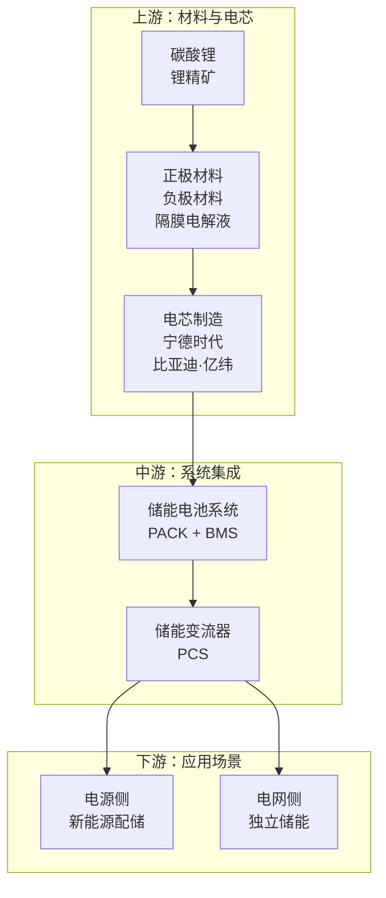

# flowchart-to-instagram

将 Mermaid flowchart TD 或层级内容转换为 Instagram 风格信息图，适合微信公众号投放。

## 核心功能

- **解析而非渲染**：提取内容结构和层级关系
- **Instagram 风格设计**：渐变背景、毛玻璃卡片、柔和配色
- **层级递进布局**：根据分组智能排版
- **品牌水印**：2×2 网格，透明度 6%，旋转 -20°

## 设计规范（v1.0 最终版）

### 背景渐变
```css
background: linear-gradient(135deg, 
  #833ab4 0%, 
  #fd1d1d 50%, 
  #fcb045 100%
);
```
紫 → 红 → 橧，Instagram 经典配色。

### 水印样式
- 2×2 网格布局（4个水印）
- 字体大小：180px
- 透明度：6%
- 旋转：-20°
- 颜色：rgba(255, 255, 255, 0.06)

### 卡片样式
- 半透明毛玻璃效果
- 渐变方向与背景一致（135deg）
- 不同区块有微色调呼应背景：
  - 上游：粉紫色调
  - 中游：红粉色调
  - 下游：橙红色调
  - 出海/政策：橙黄色调

### 字体规范
- **大标题（section-title）**：24px，font-weight: 700，#1a1a1a，居中显示
- **节点标题**：19px，font-weight: 600，#1a1a1a
- **描述文字**：15px，font-weight: 400，#3a3a3a

### 布局规范
- 最大宽度：800px
- 卡片内边距：p-6（24px）
- 节点内边距：p-5（20px）或 p-4（16px）
- 卡片间距：gap-5（20px）

### 节点配色（柔和渐变）
```
node-1: #fef7f7 → #fce8e8（粉红）
node-2: #fef9f3 → #fde9d9（橙粉）
node-3: #fef8f0 → #fde5cc（橙黄）
node-4: #f4fef7 → #dcf8e3（绿）
node-5: #f3f7fe → #dce5f8（蓝）
node-6: #f8f5fe → #e8dcf8（紫）
```

### 卡片底色（与背景呼应）
```css
/* 上游 - 粉紫色调 */
.card-1: rgba(255,240,250,0.9) → rgba(255,245,255,0.92) → rgba(255,250,245,0.9)

/* 中游 - 红粉色调 */
.card-2: rgba(255,235,245,0.9) → rgba(255,240,250,0.92) → rgba(255,245,240,0.9)

/* 下游 - 橙红色调 */
.card-3: rgba(255,230,240,0.9) → rgba(255,235,245,0.92) → rgba(255,240,235,0.9)

/* 出海/政策 - 橙黄色调 */
.card-4: rgba(255,235,235,0.9) → rgba(255,230,240,0.92) → rgba(255,240,230,0.9)
```

## 使用方法

### 方法一：Mermaid 解析器（推荐，v1.1 新增）

自动解析 Mermaid flowchart TD 语法，生成 Instagram 风格信息图：

```bash
cd ~/projects/flowchart-to-instagram

# 步骤1：解析 Mermaid 文件生成 HTML
python scripts/parse_mermaid.py input.mmd output.html

# 步骤2：HTML 转 PNG 截图
node scripts/screenshot.mjs output.html output.png

# 或使用 --demo 测试
python scripts/parse_mermaid.py --demo
```

### 方法二：Markdown Mermaid 批量转换（v2.0 新增）

从 Markdown 文件中提取所有 Mermaid 代码块，批量转换为图片：

```bash
cd ~/projects/flowchart-to-instagram

# 基本用法：转换所有 mermaid 代码块为图片
python scripts/md2images.py report.md

# 指定输出目录
python scripts/md2images.py report.md -o ./images/

# 指定文件名前缀
python scripts/md2images.py report.md --prefix fig_

# 更新 Markdown，替换代码块为图片链接
python scripts/md2images.py report.md --update

# 指定主题
python scripts/md2images.py report.md --theme instagram

# 查看所有主题
python scripts/md2images.py --list-themes
```

**输出说明**：
- 默认输出到 `output/` 目录
- 文件命名：`{prefix}{index}.png`（如 `chart_1.png`, `chart_2.png`）
- `--update` 模式会将 Markdown 中的代码块替换为 `` 格式

**支持的 Mermaid 格式**：


**解析器特性**：
- 自动提取 subgraph 作为层级卡片
- 节点格式：`A["标题\n描述"]`（换行符 `\n` 分隔标题和描述）
- 支持注释配置：`%% title:` 和 `%% watermark:`
- 节点按 subgraph 定义位置自动分组
- **Icon 支持**：节点开头可添加图标
  - Emoji：`A["🧪 氟化液"]` → 图标渲染在标题上方
  - Font Awesome：`A["fa:flask 氟化液"]` → 使用FA图标库

### 方法三：修改模板文件

1. 编辑 `templates/instagram-card.html`
2. 修改内容区块（标题、节点）
3. 用浏览器打开，截图导出

## 文件结构

```
~/projects/flowchart-to-instagram/
├── README.md                   # 项目文档
├── SKILL.md                    # 技能文档
├── scripts/
│   ├── parse_mermaid.py        # Mermaid 解析脚本
│   ├── md2images.py            # Markdown 批量转换脚本（v2.0 新增）
│   └── screenshot.mjs          # HTML → PNG 截图脚本（Playwright）
├── templates/
│   └── instagram-card.html     # HTML 模板
├── data/
│   ├── 储能产业链.mmd           # 示例 Mermaid 文件
│   └── test_mermaid.md         # 示例 Markdown 文件
└── output/                     # 输出目录
```

## 迭代记录

### v2.0 (2026-04-12)
- **新增 md2images.py**：Markdown Mermaid 批量转换
  - 从 markdown 文件提取所有 mermaid 代码块
  - 批量转换为 PNG 图片
  - 支持 `--update` 参数自动替换代码块为图片链接
- **禁用 icon 显示**：icon_to_html() 直接返回空字符串

### v1.9 (2026-04-12)
- **截图尺寸修复**：Playwright在高DPI显示器上生成1839px宽度问题
  - 使用 `clip` 强制裁剪到820px宽度
  - viewport高度从600增至2000，让内容自然展开
  - 添加 `--force-device-scale-factor=1` 启动参数
  - 使用 `document.body.scrollHeight` 获取真实内容高度
- **Emoji自动匹配扩展**：新增50+关键词映射
  - 终端应用：大模型训练(🧠)、智能驾驶(🚗)、具身机器人(🤖)、科学研究(🔬)、终端(💡)
  - 算力：算力(💻)、智算(🖥️)、超算(⚡)、数据中心(🏢)
  - 基础设施：电力(⚡)、能源(🔋)、基建(🏗️)、运维(🔧)
  - 协议与技术：协议(📜)、标准(📋)、接口(🔌)、架构(🏛️)
  - 材料与制造：材料(🧪)、制造(🏭)、工艺(⚙️)、设备(🔧)
  - 出海与应用：出海(🚢)、应用(🎯)、方案(📋)、场景(🎬)
- **链路追踪算法重构**：修复节点丢失和错误箭头问题
  - 新算法：`analyze_hierarchical_structure` 改用BFS链路追踪
  - 从根节点开始，逐层追踪完整链路（支持A→B→C→D多层级）
  - 支持分叉（A→B, A→C 形成两条链路）
  - 孤立节点单独成链，无箭头
- **Bug修复：终端应用布局遗漏描述文字**：
  - 原实现：`is_terminal_style`布局只渲染title，忽略desc
  - 新实现：检查是否有desc，渲染描述文字并增加内边距
  - 影响：上游节点（如"英伟达"+"全球GPU霸主"）正确显示描述
- **Bug修复：孤立节点位置错误**：
  - 原实现：孤立节点（无连接）被单独放最后
  - 新实现：孤立节点与第一个父节点并列显示（同一行）
  - 影响：B4节点（鹏鼎/生益）与B1节点（浪潮/华勤）并列

### v1.8 (2026-04-12)
- **自动匹配 Emoji 功能文档化**：
  - `EMOJI_KEYWORDS` 字典：100+产业链关键词映射
  - `auto_match_emoji(title)` 函数：无显式icon时自动添加
  - 调用位置：`parse_node_content()` 返回前
- **输出路径说明**：明确CLI用法，HTML/PNG输出到 `output/` 目录

### v1.7 (2026-04-12)
- **层级布局渲染修复**：修复父子节点排列方式
  - 原实现：每列纵向排列（父→子垂直）
  - 新实现：第一行父节点横向并列，第二行子节点横向并列（各自分组内）
  - 中间添加向下箭头行，视觉递进更清晰

### v1.6 (2026-04-12)
- **层级布局**：新增树形结构布局（父节点→多个子节点）
  - 自动识别父子关系（通过连接关系）
  - 与线性链路布局智能切换

### v1.5 (2026-04-12)
- **Icon 支持（Font Awesome + Emoji + 自动匹配）**：节点内容可包含图标，渲染在标题上方
  - Font Awesome 格式：`A["fas:mobile-alt 消费电子驱动\n手机+PC为主"]`
- 支持前缀：`fa`、`fas`（solid）、`fab`（brands）、`far`（regular）
- 使用 Font Awesome 6.5.1 CDN
  - Emoji 格式：`A["🧪 氟化液/硅基液"]`
- 自动识别开头emoji作为icon保留
  - **自动匹配 Emoji**：如果节点没有显式icon，根据标题关键词自动添加
- `EMOJI_KEYWORDS` 字典：100+关键词映射（产业链专用）
- 示例：`冷却液` → 🧪，`AI` → 🤖，`服务器` → ️️，`温控` → 🌡️
- 调用 `auto_match_emoji(title)` 在 `parse_node_content()` 中自动添加
  - `icon_to_html()` 函数：检测 `:` 决定是FA图标还是emoji
- **Emoji unicode范围修复**：部分emoji无法识别（如 ⚙️、⭐）
  - 原正则 `\U00002702-\U000027B0` 无法匹配 ⚙️（U+2699=9881 < U+2702=9986）
  - 新范围 `\U00002600-\U000027BF` 包含完整 Misc Symbols + Dingbats
  - 新范围 `\U00002B50-\U00002B55` 包含星星符号 ⭐
  - 新范围 `\U0000FE00-\U0000FE0F` 包含 Variation Selectors（文本符号变emoji的组合字符）
  - 新范围 `\U0001F1E0-\U0001F1FF` 包含 Flags（国旗等区域性符号）
- **Bug修复**：`remove_emoji()` 函数 unicode 范围 `\U000024C2-\U0001F251` 包含中文 CJK 字符区域
  - 导致中文字符被错误删除（如 `消费电子驱动` → `+PC`）
  - 解决：移除该 unicode 范围，只保留精确的 emoji 区域

### v1.4 (2026-04-11)
- **保留 emoji 图标**：subgraph 标题中的 emoji 现在正确显示（如 🏭 上游材料层）
- 移除 remove_emoji() 调用，让 emoji 自然渲染
- 添加 .gitignore 排除 node_modules、output、__pycache__
- 添加示例数据文件（内存涨价链、内存范式演变、液冷产业链）

### v1.3 (2026-04-11)
- 过滤 %%{init}%% 配置块和 style 定义行
- 支持节点内容换行（\n 转换为 <br> 标签）
- 修复连接正则表达式，避免匹配数字中的 `-`（如 `90-95%`）

### v1.2 (2026-04-11)
- **Bug修复**：支持中文 subgraph ID（如 `subgraph 上游["标题"]`）
  - 原正则 `[A-Za-z0-9_]+` 只支持英文ID，改为 `\S+` 支持任意非空白字符
- **Bug修复**：过滤 `%%{init}%%` 配置块，防止误解析字体设置（如 `sans-serif`）为节点
  - 添加 `in_init_block` 状态跟踪，跳过整个 init 配置块
- **Bug修复**：过滤 `style` 定义行，防止误解析样式配置
- **改进**：使用 `findall` 替代 `search`，正确解析连接行中的节点定义（如 `C1 --> C4["标题"]`）

### v1.3 (2026-04-11)
- **Bug修复**：连接正则避免匹配数字中的 `-`
  - 原正则 `[-<>]+` 会误匹配 `90-95%`、`500-1500元` 中的 `-`
  - 改为先去除节点内容 `[...]`，再匹配明确连接符号 `-{2,}>?`、`->`、`--`
- **样式改进**：section-title 居中显示（text-align: center）
- **样式改进**：section-title 字体增大至 24px
- **布局改进**：高度自适应内容
  - 移除 `min-height: 100vh`，改用 `padding-bottom: 20px`
  - 水印改为 `position: absolute`（非 `fixed`）覆盖内容区域
  - 截图高度根据实际内容自动调整

### v1.0 (2026-04-11)
- Instagram 风格渐变背景（紫→红→橙）
- 2×2 水印布局，180px 字体
- 半透明毛玻璃卡片，底色与背景呼应
- 柔和节点渐变色（6种配色方案）
- 字体规范确立（标题20px、节点19px、描述15px）
- 移除所有 icon，纯文字设计

## GitHub 管理

已发布 GitHub: https://github.com/shinelp100/flowchart-to-instagram

版本迭代：
- v1.0: 基础模板，Instagram 风格设计规范
- v1.1: Mermaid 解析器，自动化生成流程

## 解析器常见问题（v1.2 修复）

### 1. 中文 subgraph ID 不识别
**症状**：Subgraph 数量为 0 或少于预期  
**原因**：原正则 `[A-Za-z0-9_]+` 只支持英文ID  
**解决**：改为 `\S+` 支持中文ID（如 `上游`、`中游`）

### 2. 节点数量异常多（如出现 "sans"、"serif"）
**症状**：节点数比预期多，出现奇怪节点名  
**原因**：`%%{init}%%` 配置块中的字体设置被误解析  
**解决**：添加 `in_init_block` 状态跟踪，跳过整个 init 配置块

### 3. 节点丢失（连接行中定义的节点）
**症状**：节点数少于预期，`C1 --> C4["标题"]` 中 C4 未识别  
**原因**：原逻辑用 `search` 只匹配第一个节点定义  
**解决**：改用 `findall` 匹配所有节点定义

### 4. style 行被误解析
**症状**：出现无关节点  
**原因**：`style A1 fill:#xxx` 行被正则匹配  
**解决**：添加 `style` 行过滤

### 5. 连接正则误匹配数字中的 `-`
**症状**：节点数异常，如 `90`、`95` 被识别为连接节点  
**原因**：原正则 `[-<>]+` 匹配了 `90-95%`、`500-1500元` 中的 `-`  
**解决**：预处理去除 `[...]` 内容，再匹配明确连接符号 `-->`、`->`、`--`

### 6. 中文字符被删除（remove_emoji unicode 范围过宽）
**症状**：节点内容中文消失，如 `消费电子驱动\n手机+PC为主` → `+PC`  
**原因**：`remove_emoji()` 正则 `\U000024C2-\U0001F251` 范围包含 CJK 字符区域  
**解决**：移除该 unicode 范围，只保留精确的 emoji 区域

### 7. 输出路径问题
**症状**：生成PNG后找不到文件，或HTML写入错误目录  \
**原因**：脚本默认将HTML输出到输入文件同目录  \
**解决**：明确指定输出路径：
```bash
# 正确用法：第二个参数指定输出HTML路径
python scripts/parse_mermaid.py data/input.mmd output/input.html
node scripts/screenshot.mjs output/input.html output/input.png
```

### 8. 截图尺寸异常（宽度1839px而非820px）
**症状**：PNG宽度为1839px，内容变成宫格布局，仅在左上角显示  \
**原因**：Playwright在高DPI显示器上忽略deviceScaleFactor设置，fullPage模式放大截图  \
**解决**：修改 `scripts/screenshot.mjs`：
```javascript
// 关键修复：使用clip强制裁剪 + 增大viewport高度
const context = await browser.newContext({
  viewport: { width: 820, height: 2000 },  // 高度设大让内容自然展开
  deviceScaleFactor: 1,
  isMobile: false,
  hasTouch: false
});

const height = await page.evaluate(() => document.body.scrollHeight);
await page.screenshot({
  clip: { x: 0, y: 0, width: 820, height: height }  // 强制820px宽度
});
```
**v1.9更新**：screenshot.mjs 已修复此问题，现默认输出正确820px宽度

### 8. Font Awesome Icon 使用
**格式**：节点内容开头添加 `fa:icon-name` 或 `fas:icon-name`  
**示例**：`A["fas:server 液冷服务器\n整机柜方案"]`  
**渲染**：图标在标题上方，使用 Font Awesome 6.5.1 CDN

## 待开发功能

- [x] 自动解析 Mermaid flowchart TD 语法（v1.1 已完成）
- [x] 一键生成 PNG（v1.3 Playwright 截图脚本）
- [ ] 自动解析 Markdown 层级结构
- [ ] 支持自定义品牌水印文字（已通过注释支持）
- [ ] 支持多主题切换（小红书、商务简报等）
- [ ] CLI 命令行工具（npm/cli 发布）